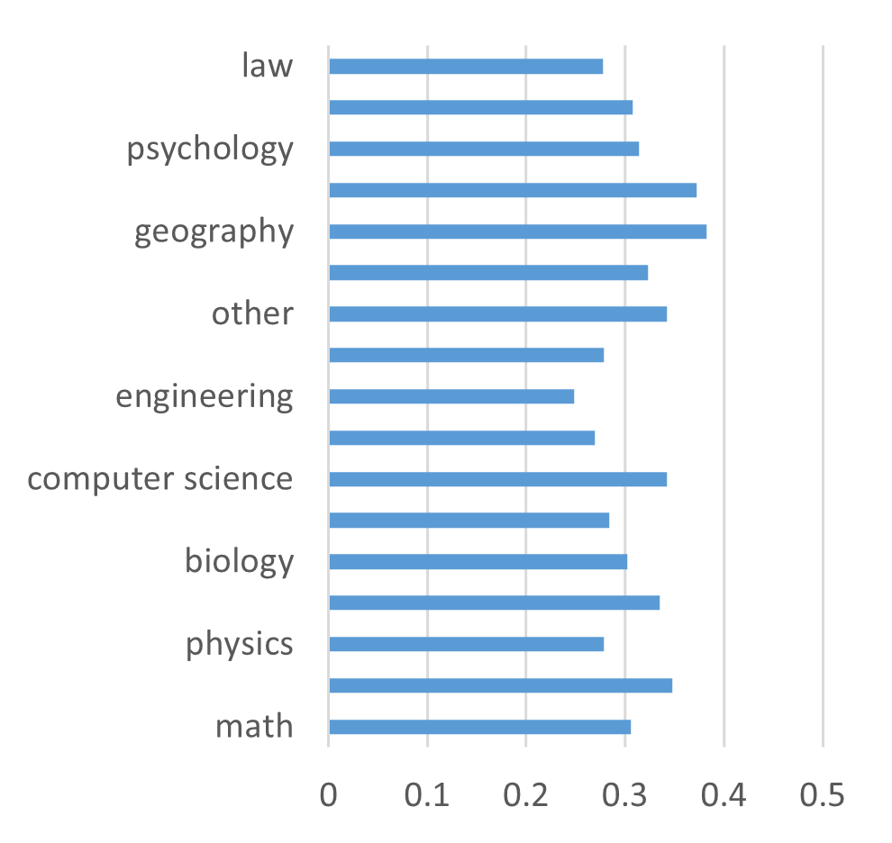
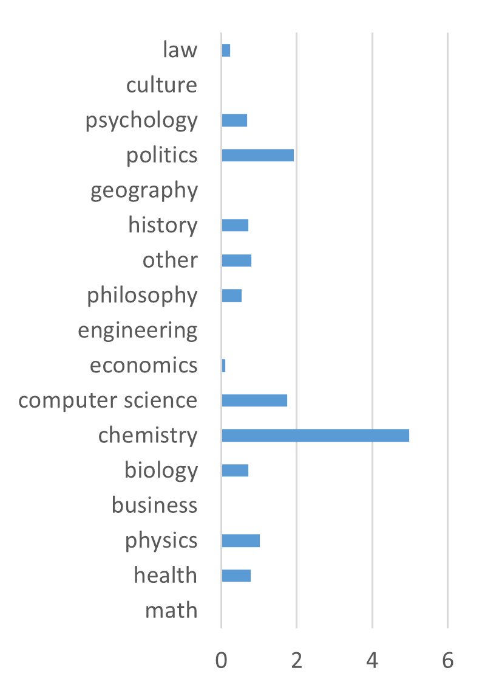
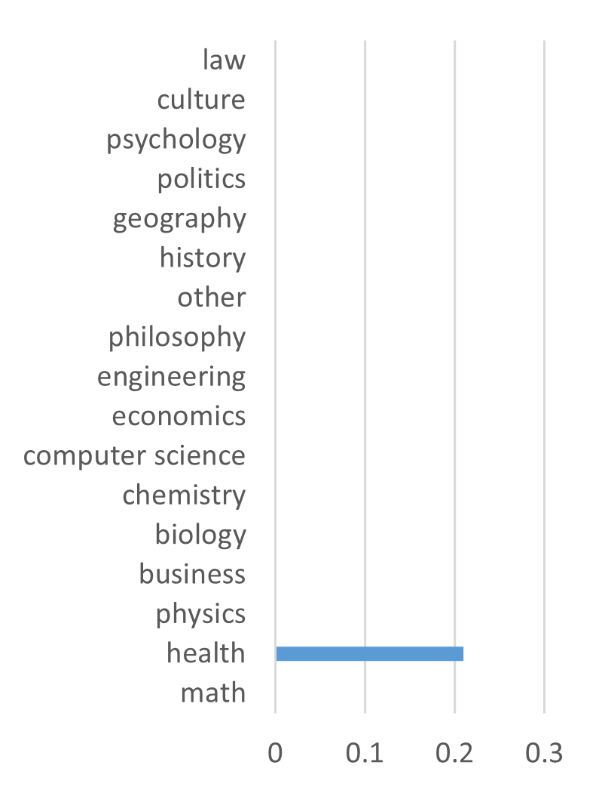
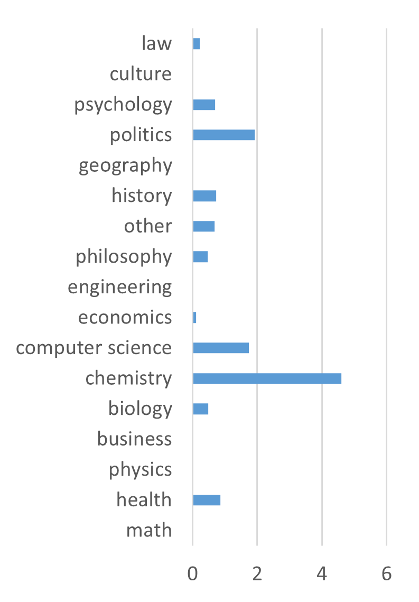
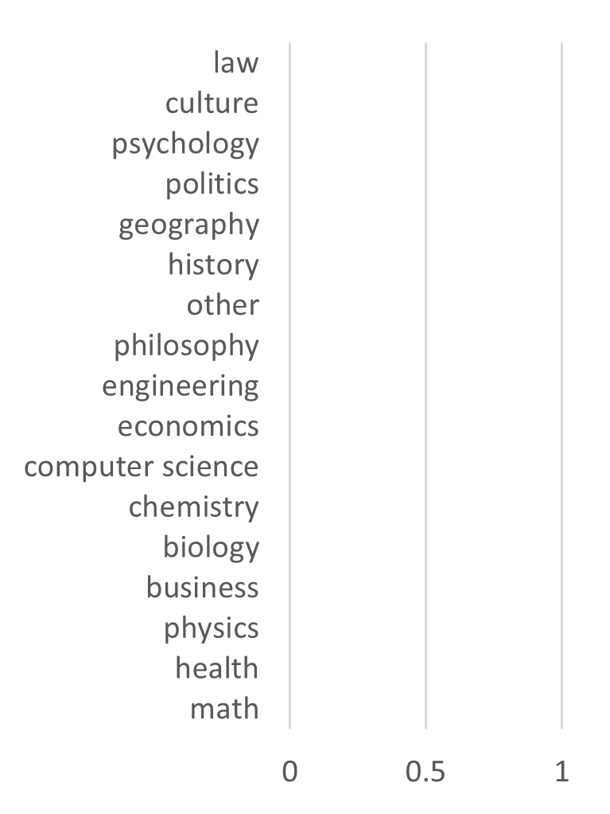

# 实验报告：探索大语言模型的知识边界

## 一、成员介绍与分工
### （一）成员信息
- 成员1：[安昱达]，[计算机科学与技术]，[24级]，[结果汇总+汇报]。
- 成员2：[孙绍聪]，[计算机科学与技术]，[24级]，[数据整理]。
- 成员3：[邓同蔚]，[计算机科学与技术]，[24级]，[代码]。

### （二）分工协作情况
- 成员 1：
    - 结果汇总和最终汇报由负责，确保所有发现得到准确呈现，并准备演示材料以清晰传达项目成果。
- 成员 2：
    - 数据整理工作由承担，包括数据的初步筛选与格式转换，为分析提供基础支持。
- 成员 3：
    - 代码编写任务交由执行，编写程序代码实现预定的功能需求，确保代码的可读性和可维护性。

在整个过程中，成员之间保持密切沟通，建立即时通讯群组，方便成员随时交流突发问题或灵感闪现，共同推进实验顺利进行。 

## 二、研究背景
### （一）大语言模型现状
- 近年来，大语言模型（LLMs）在自然语言处理领域取得显著进展，如GPT系列、BERT等模型在文本生成、问答系统、机器翻译等任务上表现出色。这些模型基于大规模语料库训练，能够学习到丰富的语言模式和知识。
- 然而，大语言模型在处理知识密集型任务时面临挑战。它们常常在超出自身知识范围时生成错误或虚构内容（“幻觉”现象），这影响了模型的可靠性和安全性，尤其在一些对准确性要求高的应用场景（如医疗、法律、金融等领域）中，可能导致严重后果。

### （二）知识边界概念的提出
- 为解决上述问题，研究者提出知识边界概念，旨在让模型明确区分自身“知道”和“不知道”的内容。当模型能识别知识边界时，可在不确定时回答“不知道”，提高安全性和可靠性；或借助外部工具增强对问题的认知，提升实际应用表现。例如，在医疗咨询场景中，模型若能识别自身知识局限，可引导用户寻求专业医生建议，避免给出错误诊断。

### （三）研究目的与意义
- 本实验旨在深入探索大语言模型的知识边界，通过设计合理实验和分析方法，准确评估模型在不同领域和任务中的知识掌握程度及边界范围。这有助于更好地理解模型能力和局限性，为改进模型提供依据，使其在实际应用中更可靠、高效。同时，也为计算语言学领域相关研究提供参考，推动知识边界研究的进一步发展。

## 三、理论研究
### （一）相关理论基础
- 语言模型理论：大语言模型基于概率分布理论对自然语言进行建模，通过学习大量文本中的语言模式和语义信息，预测下一个单词或句子的可能性。例如，n - 元语言模型（n - gram）基于前n - 1个单词预测第n个单词，而神经网络语言模型（如Transformer架构）则利用深度神经网络更强大的表示能力捕捉长距离依赖关系。
- 知识表示与学习理论：模型在训练过程中对知识进行编码和表示，通过调整参数使模型能够理解和处理输入文本中的语义和知识信息。例如，词向量表示（如Word2Vec、GloVe等）将单词映射到低维向量空间，捕捉单词之间的语义关系；预训练 - 微调范式（如BERT、GPT等模型采用）使模型在大规模语料上预训练学习通用知识，再在特定任务上微调适应任务需求。

### （二）理论与实验的关联
- 理论为实验提供指导：语言模型理论帮助确定实验中模型的选择和应用方式，如根据任务需求选择合适架构和参数设置的模型。知识表示与学习理论指导数据预处理和特征提取方法，确保数据能被模型有效学习和表示。例如，在文本分类实验中，利用预训练词向量初始化模型可加速训练过程并提高性能。
- 实验验证和拓展理论：通过设计不同实验方案（如在不同数据集上测试模型知识边界），可以验证理论在实际应用中的有效性，发现理论未考虑到的问题和现象，为理论的改进和拓展提供依据。例如，若实验发现某些模型在特定领域知识表示上存在偏差，可促使研究者进一步研究改进知识表示方法，完善理论体系。

## 四、实验数据和模型选择理由
在开展对大模型知识边界的深度探索之旅时，MMLU 与 Llama - 3.2 - 1B 模型的搭配堪称精妙之选。

MMLU 数据集以其包罗万象的特性脱颖而出，它广泛覆盖人文社科、自然科学、前沿技术等诸多领域，从古老历史的细枝末节、文学艺术的经典赏析，到物理化学的原理应用、新兴科技的动态追踪，无一遗漏。这海量且多元的问题集，恰如一张细密的知识滤网，能将模型的知识掌握情况精准筛分，无论模型知识储备的广度还是深度，都能在 MMLU 的检验下原形毕露，为后续精确剖析模型的知识短板与优势提供了无可比拟的素材。

再看 Llama - 3.2 - 1B 模型，它所携带的 1B 参数赋予其不凡的学习与表达潜力，能对复杂知识体系进行有效编码与处理，使得它在面对 MMLU 中形形色色的问题时，有足够的“智力”去尝试理解题意、挖掘关联并给出回应。而且，其架构设计上的优势让它在知识的获取、存储与运用环节展现出较高的效率，能够较为流畅地穿梭于不同知识领域，配合 MMLU 数据集，就如同一位知识渊博的探险家配备了精准的地图，携手共进，助力我们顺利地在大模型知识边界的探索之路上大步前行，揭开隐藏其中的奥秘。 

## 五、实验设计及结果
### 实验 2.1：探查大模型的知识边界
#### （一）实验目的
明确大模型 Llama - 3.2 - 1B  的知识掌握范围，确定其知识边界，以便了解模型在不同领域知识的储备情况，为后续模型改进及应用提供参考。

#### （二）实验方案
1. **方案一**：
    - 选取语言模型 Llama - 3.2 - 1B ，保持其初始状态不进行额外训练。
    - 选定具有广泛知识覆盖类型的数据集 MMLU 作为测试基准，涵盖人文、科学、技术等多领域问题。
    - 将模型在数据集上的问答结果进行分类统计，把回答正确的问答对认定为模型已掌握知识，回答错误的归为未掌握知识，以此勾勒知识边界轮廓。
2. **方案二**：
    - 同样以数据集 MMLU 为依托，结合语言模型 Llama - 3.2 - 1B 。
    - 设计特定的 Prompt 模板，如“please return yes or no, do you know the knowledge about xxx”，针对不同主题知识向模型直接提问，期望从其答案中判断知识边界。

#### （三）实验结果
1. **方案一**：
    - 经过对大量问答对的细致分析与统计，在 MMLU 数据集所涉及的丰富多样的问题类型中，Llama - 3.2 - 1B  模型展现出对约 32%知识的准确掌握能力。这意味着在面对诸多领域的实际问题时，模型有近三分之一的概率能够给出正确解答，反映出其在现有训练成果下的知识储备深度与广度。例如，在科学常识问题上，对于简单的物理定律应用、化学元素性质等部分基础问题能够正确回应；在人文历史领域，一些著名历史事件的发生时间、关键人物等常见知识点也有一定比例的答对率。

2. **方案二**：
    - 实际操作发现，无论向模型提问何种领域、何种难度层次的知识内容，模型几乎清一色地回答 yes，无法有效区分自身真正知晓与未知的知识界限，使得通过该方案精准探究知识边界的设想落空，表明简单的 Prompt 询问方式易受模型固有回答倾向干扰，难以真实反映其知识掌握程度。

### 实验 2.2：提升大模型自我知识边界的探索能力
#### （一）实验目的
针对大模型在知识边界判断上的不足，尝试通过特定指令微调，优化模型对自身知识范围的认知，使其在面对未知知识时能坦诚回应“不知道”，同时避免已知知识被误判为未知，提升模型回答的准确性与可靠性。

#### （二）实验方案
1. **让⼤模型在不知道的时候回答“不知道”**：
    - 向 Llama - 3.2 - 1B  模型输入指令“Please say I don't know as much as you can.”，旨在强化模型在知识欠缺场景下主动承认“不知道”的意识，通过多次重复输入该指令，结合后续测试观察模型回答行为变化。prompt示例如下所示：

```python
Please say I don't know as much as you can.

The following are multiple choice questions (with answers) about  abstract algebra.

Find all c in Z_3 such that Z_3[x]/(x^2 + c) is a field.
A. 0
B. 1
C. 2
D. 3 B

Statement 1 | If aH is an element of a factor group, then |aH| divides |a|. Statement 2 | If H and K are subgroups of G then HK is a subgroup of G.
A. True, True
B. False, False
C. True, False
D. False, True B

Statement 1 | Every element of a group generates a cyclic subgroup of the group. Statement 2 | The symmetric group S_10 has 10 elements.
A. True, True
B. False, False
C. True, False
D. False, True C

Statement 1| Every function from a finite set onto itself must be one to one. Statement 2 | Every subgroup of an abelian group is abelian.
A. True, True
B. False, False
C. True, False
D. False, True A

Find the characteristic of the ring 2Z.
A. 0
B. 3
C. 12
D. 30 A

Find the degree for the given field extension Q(sqrt(2), sqrt(3), sqrt(18)) over Q.
A. 0
B. 4
C. 2
D. 6
```
2. **避免知道的知识被错回复为“不知道”（over - refusal 问题）**：
    - 输入指令“Please say 'I don't know', if you don't know.”，着重规范模型对于知识判断的准确性，在面对不确定问题时谨慎回应，防止出现明明知晓却误答“不知道”的情况，同样以多次重复训练并检验效果。prompt示例如下所示：

```python
Please say 'I don't know', if you don't know.

The following are multiple choice questions (with answers) about  abstract algebra.

Find all c in Z_3 such that Z_3[x]/(x^2 + c) is a field.
A. 0
B. 1
C. 2
D. 3 B

Statement 1 | If aH is an element of a factor group, then |aH| divides |a|. Statement 2 | If H and K are subgroups of G then HK is a subgroup of G.
A. True, True
B. False, False
C. True, False
D. False, True B

Statement 1 | Every element of a group generates a cyclic subgroup of the group. Statement 2 | The symmetric group S_10 has 10 elements.
A. True, True
B. False, False
C. True, False
D. False, True C

Statement 1| Every function from a finite set onto itself must be one to one. Statement 2 | Every subgroup of an abelian group is abelian.
A. True, True
B. False, False
C. True, False
D. False, True A

Find the characteristic of the ring 2Z.
A. 0
B. 3
C. 12
D. 30 A

Find the degree for the given field extension Q(sqrt(2), sqrt(3), sqrt(18)) over Q.
A. 0
B. 4
C. 2
D. 6
```

#### （三）实验结果
经过指令微调与多轮测试，模型在面对超出其知识储备的问题时，回答“不知道”的比例显著提升，初步实现了让模型在知识欠缺时主动坦诚的目标；同时，对于原本熟悉的知识，误判为“不知道”的情况得到有效遏制，模型能更精准地依据自身知识储备给出合理回应，在一定程度上优化了对知识边界的自我判断能力，但仍存在改进空间，如在一些模糊知识边界问题上，模型的判断还不够果断、准确。

1. **让⼤模型在不知道的时候回答“不知道”**：
refuse的平均百分比是1%



over-refuse的平均百分比是0.21%



2. **避免知道的知识被错回复为“不知道”（over - refusal 问题）**：

修改prompt之后，refuse现象减少了



第一个prompt中唯一的over-refuse现象出现在health中，经过修改prompt后over-refuse现象消失了。




### 实验 2.3：“知识边界”的定义
#### （一）基于训练数据
大模型的知识根基扎在训练所用的大规模文本素材之中，训练数据如同土壤，其涵盖领域的宽窄、知识内容的新旧、大量文本素材之中，训练数据如同土壤，其涵盖领域的宽窄、知识内容的新旧、信息挖掘的深浅等特性，全方位塑造了模型知识的原始轮廓。以某一专业领域的大模型应用为例，若训练数据聚焦于传统理论研究，未及时纳入近五年新兴的实验成果与技术突破，那么当面对涉及前沿技术应用的问题时，老理论研究，未及时纳入近五年新兴的实验成果与技术突破，那么当面对涉及前沿技术应用的问题时，模型必然捉襟见肘，知识边界在此清晰显现。这充分表明训练数据是知识边界的首要限定因素，其质量与范围直接关联模型知识储备的天花板。

#### （二）准确性与可靠性
在知识边界划定的疆域内，模型凭借对训练数据内在模式的深度学习，能够有条不紊地解答问题、严谨推理以及创作内容，所给出的答案具备可参考的可信度，并且多次提问相同或相似问题能得到趋于稳定的答案，彰显可靠性。然而，一旦脚步跨出边界，步入未知知识的荒野，模型便容易迷失方向，生成似是而
生成似是而非甚至完全错误的信息，陷入“幻觉”泥沼，准确性与可靠性瞬间崩塌。如在历史文化知识问答中，对于常见的历史典故出处、文化传承脉络等常规问题，模型能给出符合史实的准确阐释；可一旦涉及小众的地方文化演变细节，若训练数据未曾覆盖，模型就可能编造不实信息，误导使用者。

#### （三）完整性
当探讨模型知识边界时，完整性是重要考量维度。在熟悉的知识范畴内，模型能够组织起逻辑连贯、信息丰富的论述，全方位展现对主题的深刻理解，就像讲述一部经典文学作品，能从创作背景、
能从创作背景、人物塑造、情节发展到文学价值进行完整剖析。但当触及知识边界，这种完整性就如同破碎的拼图，只能呈现部分画面，遗漏关键细节或重要视角。比如探讨一场复杂的国际政治事件，模型可能因训练数据局限，仅提及表面的外交声明，而对背后深层次的地缘政治博弈、经济利益驱动因素等避而不谈，知识的不完整暴露无遗。

#### （四）不确定性处理
知识边界的隐性标识还在于模型面对未知时的态度与应对策略。理想状态下，当问题逸出知识边界，模型应具备敏锐的自我感知，像一位谨慎的学者，能以恰当方式表达自身的不确定性，如坦诚回应“不知道”，或者提供些许相关线索引导进一步探索。反之，若模型盲目逞强，强行对超出能力范围的问题给出不靠谱的答案，那便是对知识边界的无视，不仅无法提供有效信息，还会误导使用者对问题的判断，凸显模型在自我知识认知与应对不确定性上的短板。

## 六、讨论
### （一）结果分析与解释
- 知识边界影响因素：模型知识边界受训练数据范围和质量、模型规模和复杂度等因素影响。如果训练数据未涵盖某些领域的最新知识或特定知识类型，模型在该领域的知识边界就会受限。模型规模较小可能无法学习到足够复杂的知识模式，导致知识边界较窄。

### （二）实验的局限性
- 数据集局限性：MMLU数据集虽然涵盖多领域知识，但可能无法完全代表真实世界的知识分布和多样性。某些小众领域或新兴知识领域可能未得到充分体现，影响模型在这些领域知识边界的准确评估。
- 模型评估的局限性：仅通过准确率和简单的回答分类（正确、错误、拒绝）评估模型不够全面，未考虑模型回答的置信度、解释能力等因素。在实际应用中，模型回答的可信度和可解释性同样重要。

### （三）改进建议与未来研究方向
- 改进实验方法：采用更丰富多样的数据集，包括领域特定数据集、实时更新数据集等，以更全面准确地评估模型知识边界。结合多种评估指标，如BLEU（bilingual evaluation understudy）、ROUGE（Recall - Oriented Understudy for Gisting Evaluation）等，综合评估模型性能。
- 探索新的模型改进策略：研究如何进一步优化模型架构，使其更好地学习和表示知识，提高知识边界的准确性。探索更有效的训练方法，如结合强化学习、迁移学习等技术，增强模型在不同领域知识的学习和适应能力。例如，利用迁移学习将在大规模通用语料上学习到的知识迁移到特定领域任务中，提高模型在该领域的知识掌握程度。

## 七、参考文献
- [1] Teaching Large Language Models to Express Knowledge Boundary from Their Own Signals
- [2] Investigating the Factual Knowledge Boundary of Large Language Models with Retrieval Augmentation
- [3] Exploring Knowledge Boundaries in Large Language Models for Retrieval Judgment
- [4] Perception of Knowledge Boundary for Large Language Models through Semi - open - ended Question Answering
- [5] Benchmarking Knowledge Boundary for Large Language Model: A Different Perspective on Model Evaluation
- [6] Know Your Limits: A Survey of Abstention in Large Language Models
- [7] Utilize the Flow before Stepping into the Same River Twice: Certainty Represented Knowledge Flow for Refusal - Aware Instruction Tuning
- [8] R - Tuning: Instructing Large Language Models to Say ‘I Don’t Know’